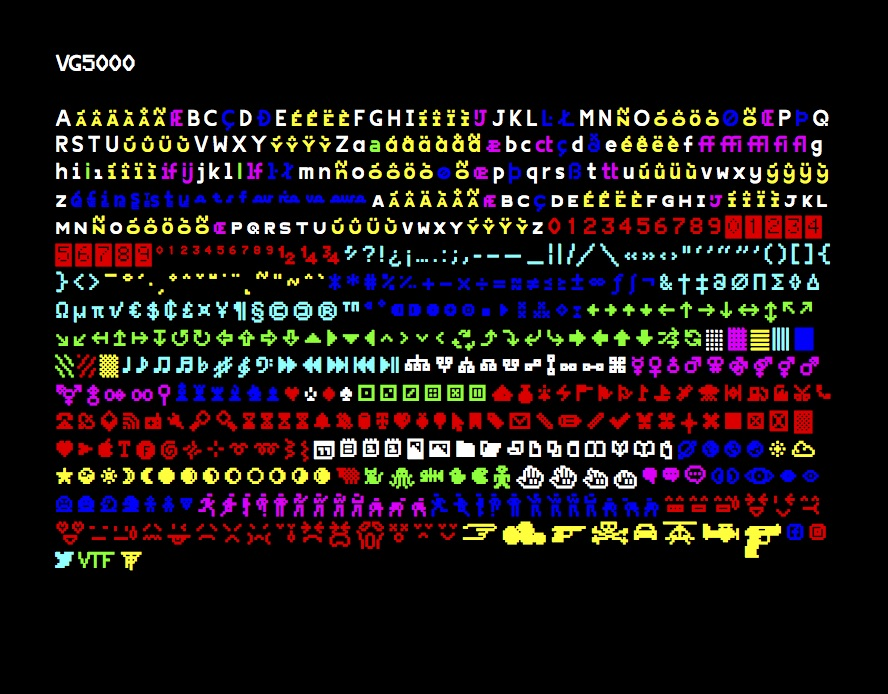
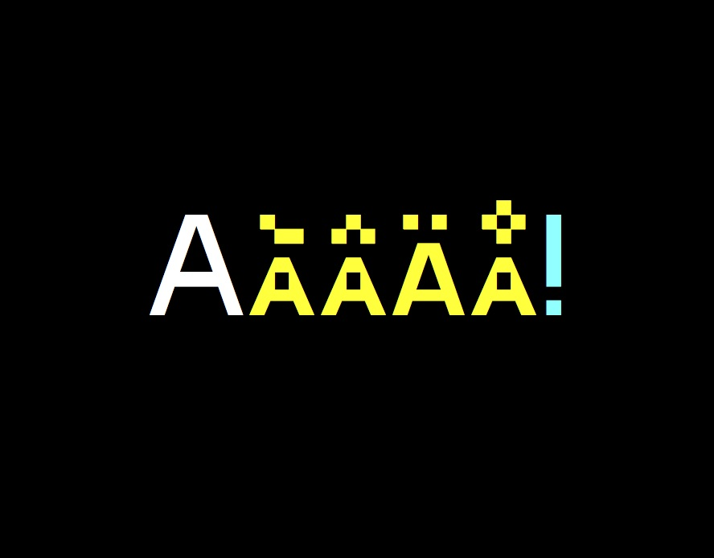
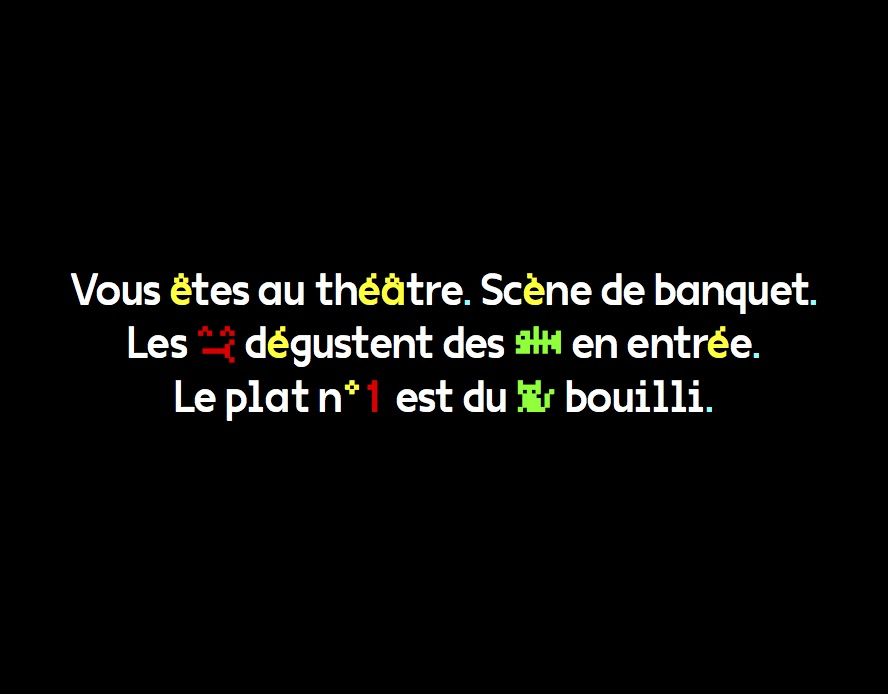
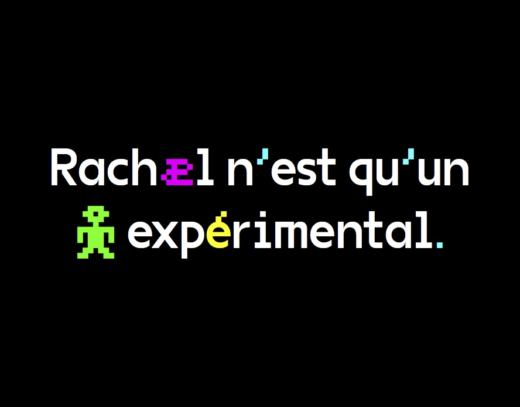
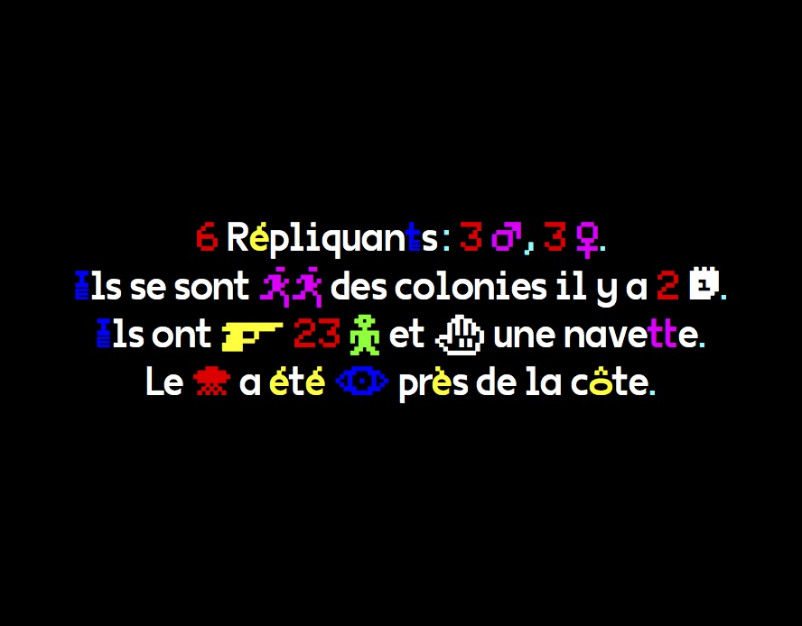

# VG5000

The VG5000 takes its name from the homonymous computer manufactured by Phillips, released in 1984. Its video processor displays bitmap characters built in a common matrix of 8x10 dots. The modern VG5000 is built on a grid 4 times more detailed, allowing more freedom and imagination of curves, where there were only right angles. The superposition of the new drawing onto the starting matrix sometimes reveals unexpected mixtures. Some right angles have been deliberately preserved as vestiges of the first digital fonts, offering a hybrid final shape. One of the inherited features is the accents that are always placed at the same height, forcing some letters to crash. Many glyphs and pictograms complete the VG5000's original set, including references to VG5000 games and the history of emoji.

### Inclusive characters

The VG5000 character set contains a sample of experimental glyphs devoted to French
inclusive writing, which involves linking the female and male genders in the writing field. These
glyphs were imagined on the occasion of the project "On aime pas ça parce qu’on devient deux"
initiated by [Roxanne Maillet](http://caveclub.cc/), artist having as a commitment research on the graphic
representation of genders in writing: if it is not « il » or « elle » who speaks, it is « iel ». These
new characters are built on the same grid as the originals, but they are smaller and combine
together in one character.

*Exemples / Examples :*
·e : étudiant·e | é·e : né·e | f/ve : veuf·ve | n·e : un·e | s·e : permis·e | u·e : vu·e | ie : iel

VG5000 is a typeface by [Justin Bihan](http://www.cj2b.work).
Contribute or download it on [Velvetyne Type Foundry](http://velvetyne.fr/fonts/vg5000/).

## Specimen

## License

This Font Software is licensed under the SIL Open Font License, Version 1.1.
This license is copied below, and is also available with a FAQ at
http://scripts.sil.org/OFL

## Repository Layout

This font repository structure is inspired by [Unified Font Repository v0.3](https://github.com/unified-font-repository/Unified-Font-Repository).
